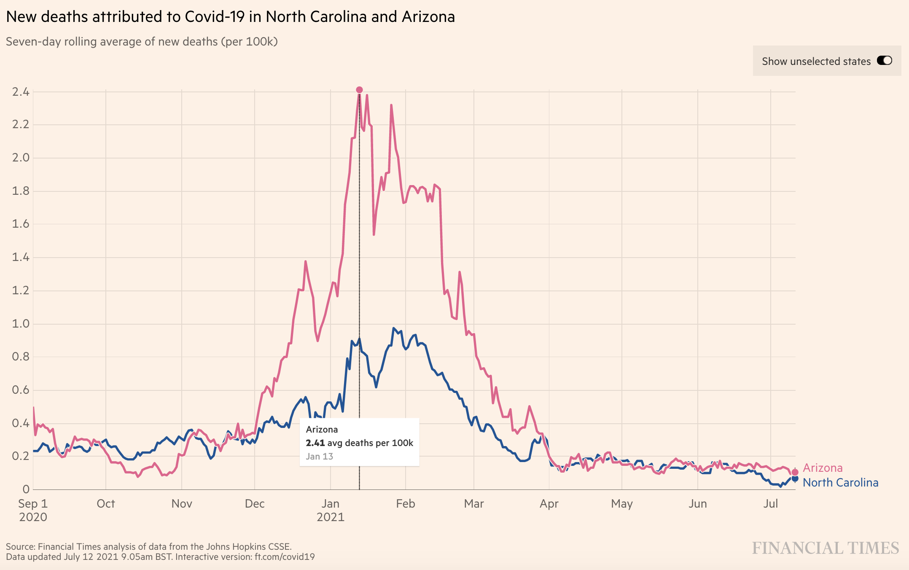

class: titleSlide, hide_logo

```{r setup, include=FALSE}
library(tidyverse)
library(xaringan)
library(xaringanExtra)
library(xaringanthemer)
library(here)
library(sysfonts)
library(showtext)
library(countdown)
library(lubridate)
library(zoo)
library(ftplottools)
library(viridis)
library(palmerpenguins)
library(ggdist)
library(patchwork)

options(htmltools.dir.version = FALSE)
knitr::opts_chunk$set(
  fig.width=9, fig.height=3.5, fig.retina=3,
  out.width = "100%",
  cache = FALSE,
  echo = TRUE,
  message = FALSE, 
  warning = FALSE,
  hiline = TRUE
)
```

```{r xaringan-panelset, echo=FALSE}
xaringanExtra::use_panelset()
```

```{r xaringan-editable, echo=FALSE}
xaringanExtra::use_editable(expires = 1)
```

```{r xaringan-extra-styles, echo=FALSE}
xaringanExtra::use_extra_styles(
  hover_code_line = TRUE,         #<<
  mute_unhighlighted_code = TRUE  #<<
)
```

```{r xaringanExtra-clipboard, echo=FALSE}
xaringanExtra::use_clipboard()
```

```{r share-again, echo=FALSE}
xaringanExtra::use_share_again()
xaringanExtra::style_share_again(share_buttons="none")
```

```{r xaringan-themer, include=FALSE, warning=FALSE, eval=T}
style_duo_accent(
  primary_color = "#1f9ac9",
  secondary_color = "#444444",
  header_font_google = google_font("Source Sans Pro"),
  text_font_google   = google_font("Libre Franklin", "300", "300i"),
  code_font_google   = google_font("Anonymous Pro"),
  base_font_size = "30px",
  text_font_size = "1rem",
  header_h1_font_size = "2.5rem",
  header_h2_font_size = "2rem",
  header_h3_font_size = "1.25rem",
  padding = "8px 32px 8px 32px",
)

font_add_google("Poppins", "Poppins")
font_add_google("Libre Franklin", "Frank")
showtext_auto()
```

```{r xaringan-logo, echo=FALSE, eval=FALSE}
xaringanExtra::use_logo(
  image_url = "logo.png"
)
```

# Data Visualization

## Designing effective plots

<br>
<center></center>

---
class: left, hide_logo, hide-count

## Setup

.pull-left[
**Option 1**
* Download and unzip today's materials into `glhlth562/materials`
* Find and open the `dataviz2_template.Rmd` file in `materials/dataviz2`.
]

.pull-right[
**Option 2**
* Pull updates from [github](https://github.com/ericpgreen/glhlth562) (assumed you cloned this repo previously)
* Find and open the `dataviz2_template.Rmd` file in `materials/dataviz2`.
]
---

class: newTopicSub, hide_logo

# Labels, themes, annotations, scales

---

class: left

### Let's return to our FT example

```{r echo=FALSE, out.width="70%", fig.align="center"}

```

---

class: left

### Load the data if it's not already loaded

```{r glimpse}
  covid <- read_csv("https://raw.githubusercontent.com/ericpgreen/glhlth562/main/materials/dataviz1/covid.csv")
  glimpse(covid)
```

---

class: left

### Here's where we left off

.panelset[
.panel[.panel-name[Code]

```{r resume_code, eval=FALSE}
# see chunk 'resume'
p <- covid %>%                                    # data
  ggplot(aes(x = date, y = deaths_roll7_100k,     # mapping
             color = Province_State)) +
         geom_line() +                            # geom
         scale_color_manual(values = c(           # theme
                                       "#eb5e8d",   # pink 
                                       "#0f5599"    # blue
                                       )) 
p                              
```

]

.panel[.panel-name[Plot]

```{r resume_plot, echo=FALSE, out.width='70%'}
p <- covid %>%                                    # data
  ggplot(aes(x = date, y = deaths_roll7_100k,     # mapping
             color = Province_State)) +
         geom_line() +                            # geom
         scale_color_manual(values = c(           # theme
                                       "#eb5e8d",   # pink 
                                       "#0f5599"    # blue
                                       )) 
p   
```
]
]


---

class: left

### Adjust the scales

.panelset[
.panel[.panel-name[Code]

```{r scales_code, eval=FALSE}
# see chunk 'scales'
p <- p +
  scale_y_continuous(breaks = seq(____, ____, _____)) +
  scale_x_date(date_breaks = "_______", #date_labels = "%b",
               # https://stackoverflow.com/a/50116294/841405
               labels = function(x) if_else(month(x) == 9 | month(x) == 1, 
                                            paste(month(x, label = TRUE),
                                                  "\n", year(x)), 
                                            paste(month(x, label = TRUE))))
p      
```

]

.panel[.panel-name[Answer]

```{r scales_answer, eval=FALSE}
# see chunk 'scales'
p <- p +
  scale_y_continuous(breaks = seq(0, 2.4, .2)) +
  scale_x_date(date_breaks = "1 month", #date_labels = "%b",
               # https://stackoverflow.com/a/50116294/841405
               labels = function(x) if_else(month(x) == 9 | month(x) == 1, 
                                            paste(month(x, label = TRUE),
                                                  "\n", year(x)), 
                                            paste(month(x, label = TRUE))))
p      
```

]

.panel[.panel-name[Plot]

```{r scales_plot, echo=FALSE, out.width='70%'}
p <- p +
  scale_y_continuous(breaks = seq(0, 2.4, .2)) +
  scale_x_date(date_breaks = "1 month", #date_labels = "%b",
               # https://stackoverflow.com/a/50116294/841405
               labels = function(x) if_else(month(x) == 9 | month(x) == 1, 
                                            paste(month(x, label = TRUE),
                                                  "\n", year(x)), 
                                            paste(month(x, label = TRUE))))
p    
```
]
]

---

class: left

### Annotate

.panelset[
.panel[.panel-name[Code]

```{r annotate_code, eval=FALSE}
# see chunk 'annotate'
p <- p +
  geom_vline(xintercept = as.Date("2020-12-20"), 
             linetype="solid", color="black") +
  annotate("text", x = as.Date("2020-12-20"), y = ___, 
           label = "US vaccine launch", hjust=1.1) +
  geom_segment(aes(x=as.Date("2021-03-11"), xend=as.Date("2021-03-11"), 
                   y=___, yend=___), linetype="dashed", color="#0f5599") +
  annotate("text", x = as.Date("2021-03-11"), y = ___, label = "NC 10% fully vaccinated",
           color="#0f5599", hjust=-0.1) +
  geom_segment(aes(x=as.Date("2021-03-08"), xend=as.Date("2021-03-08"),       
                   y=0, yend=1.4), linetype="dashed", color="#eb5e8d") +
  annotate("text", x = as.Date("2021-03-08"), y = 1.4, label = "___",
           color="#eb5e8d", hjust=-0.1)
p  
```

]

.panel[.panel-name[Plot]

```{r annotate_plot, echo=FALSE, out.width='70%'}
p <- p +
  geom_vline(xintercept = as.Date("2020-12-20"), 
             linetype="solid", color="black") +
  annotate("text", x = as.Date("2020-12-20"), y = 2.2, 
           label = "US vaccine launch", hjust=1.1) +
  geom_segment(aes(x=as.Date("2021-03-11"), xend=as.Date("2021-03-11"), 
                   y=0, yend=1), linetype="dashed", color="#0f5599") +
  annotate("text", x = as.Date("2021-03-11"), y = 1, label = "NC 10% fully vaccinated",
           color="#0f5599", hjust=-0.1) +
  geom_segment(aes(x=as.Date("2021-03-08"), xend=as.Date("2021-03-08"),       
                   y=0, yend=1.4), linetype="dashed", color="#eb5e8d") +
  annotate("text", x = as.Date("2021-03-08"), y = 1.4, label = "AZ 10% fully vaccinated",
           color="#eb5e8d", hjust=-0.1)
p  
```
]
]

---

class: left

### Labels

.panelset[
.panel[.panel-name[Code]

```{r label_code, eval=FALSE}
# see chunk 'label'
p <- p +
  labs(title = "New deaths attributed to COVID-19 in North Carolina and Arizona",
       subtitle = "Seven-day rolling average of new deaths (per 100k)",
       y = NULL,
       x = NULL,
       caption = "Source: Financial Times analysis of data from the Johns Hopkins CSSE.") 
p
```

]

.panel[.panel-name[Plot]

```{r label_plot, echo=FALSE, out.width='70%'}
p <- p +
  labs(title = "New deaths attributed to COVID-19 in North Carolina and Arizona",
       subtitle = "Seven-day rolling average of new deaths (per 100k)",
       y = NULL,
       x = NULL,
       caption = "Source: Financial Times analysis of data from the Johns Hopkins CSSE.") 
p
```
]
]

---

class: left

### Themes

.panelset[
.panel[.panel-name[Code]

```{r theme_code, eval=FALSE}
# see chunk 'theme'
p <- p +
  theme_minimal() +
  theme(panel.grid.minor = element_blank(),
        plot.title.position = "plot",
        plot.title = element_text(face="bold"),
        legend.position = "none")
p
```

]

.panel[.panel-name[Plot]

```{r theme_plot, echo=FALSE, out.width='70%'}
p <- p +
  theme_minimal() +
  theme(panel.grid.minor = element_blank(),
        plot.title.position = "plot",
        plot.title = element_text(face="bold"),
        legend.position = "none")
p
```
]
]

---

class: left

# Credits

Deck by Eric Green ([@ericpgreen](https://twitter.com/ericpgreen)), licensed under Creative Commons Attribution [CC BY-SA 4.0](https://creativecommons.org/licenses/by-sa/4.0/)

* {[`xaringan`](https://github.com/yihui/xaringan)} for slides with help from {[`xaringanExtra`](https://github.com/gadenbuie/xaringanExtra)}
* [JHU CSSE COVID-19 data](https://github.com/CSSEGISandData/COVID-19)
