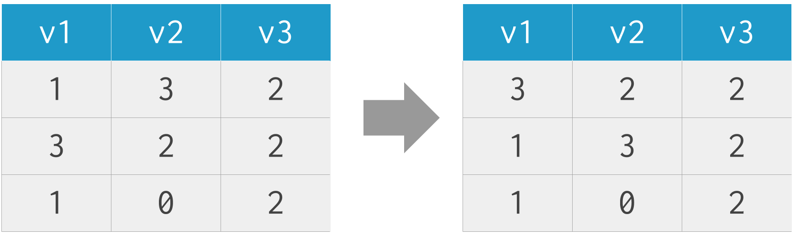
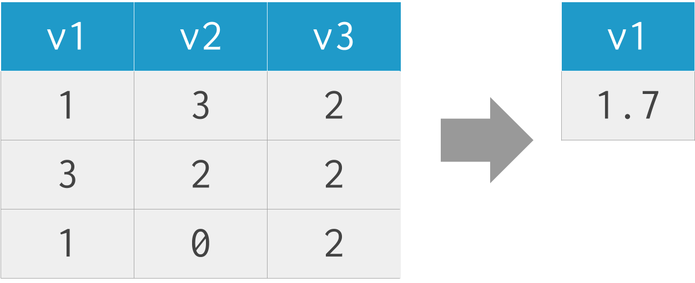

class: titleSlide, hide_logo

```{r setup, include=FALSE}
library(tidyverse)
library(xaringan)
library(xaringanExtra)
library(xaringanthemer)
library(here)
library(sysfonts)
library(showtext)
library(countdown)
library(nycflights13)

options(htmltools.dir.version = FALSE)
knitr::opts_chunk$set(
  fig.width=9, fig.height=3.5, fig.retina=3,
  out.width = "100%",
  cache = FALSE,
  echo = TRUE,
  message = FALSE, 
  warning = FALSE,
  hiline = TRUE
)
```

```{r xaringan-panelset, echo=FALSE}
xaringanExtra::use_panelset()
```

```{r xaringan-editable, echo=FALSE}
xaringanExtra::use_editable(expires = 1)
```

```{r xaringan-extra-styles, echo=FALSE}
xaringanExtra::use_extra_styles(
  hover_code_line = TRUE,         #<<
  mute_unhighlighted_code = TRUE  #<<
)
```

```{r xaringanExtra-clipboard, echo=FALSE}
xaringanExtra::use_clipboard()
```

```{r share-again, echo=FALSE}
xaringanExtra::use_share_again()
xaringanExtra::style_share_again(share_buttons="none")
```

```{r xaringan-themer, include=FALSE, warning=FALSE, eval=T}
style_duo_accent(
  primary_color = "#1f9ac9",
  secondary_color = "#444444",
  header_font_google = google_font("Source Sans Pro"),
  text_font_google   = google_font("Libre Franklin", "300", "300i"),
  code_font_google   = google_font("Anonymous Pro"),
  base_font_size = "30px",
  text_font_size = "1rem",
  header_h1_font_size = "2.5rem",
  header_h2_font_size = "2rem",
  header_h3_font_size = "1.25rem",
  padding = "8px 32px 8px 32px",
)

font_add_google("Poppins", "Poppins")
font_add_google("Libre Franklin", "Frank")
showtext_auto()
```

```{r xaringan-logo, echo=FALSE, eval=FALSE}
xaringanExtra::use_logo(
  image_url = "logo.png"
)
```

# Data Wrangling

## Data transformation

<br>
<center></center>

---

class: newTopicSub, hide_logo

# `dplyr`

<center>

</center>

---
class: left, hide-count

## `dplyr`

<center>

</center>

---
class: left, hide-count

## `filter(data, v2 != 0)`

<center>

</center>

picks cases based on their values

---
class: left, hide-count

### `filter()`

.panelset[

.panel[.panel-name[Data]

```{r, echo=FALSE}
  flights
```

]

.panel[.panel-name[Code]

```{r, eval=FALSE}
  filter(flights, month == 1, day == 1)

# equivalent to:
#   filter(flights, month==1 & day == 1)
#   flights %>% filter(month == 1, day == 1)
```

]

.panel[.panel-name[Result]

```{r, echo=FALSE}
  filter(flights, month == 1, day == 1)
# equivalent to:
#   filter(flights, month==1 & day == 1)
#   flights %>% filter(month == 1, day == 1)
```

]

.panel[.panel-name[Notes]

**Comparison operators:**
`>`, `>=`, `<`, `<=`, `==` (equal to), `!=` (not equal to), `%in%`

**Logical operators:**
`|` (OR), `&` (AND), `!` (NOT)

**Is missing:**
`filter(is.na(variable))`

**Is NOT missing:**
`filter(!is.na(variable))`

]
]

---
class: left, hide-count

## `arrange(data, v1)`

<center>

</center>

changes the ordering of the rows

---
class: left, hide-count

### `arrange()`

```{r}
arrange(flights, desc(year), month, day)
# flights %>% arrange(desc(year), month, day)
```

---
class: left, hide-count

## `select(data, -v3)`

<center>

</center>

picks variables based on their names

---
class: left, hide-count

### `select()`

.panelset[

.panel[.panel-name[Include]

```{r}
select(flights, year, month, day)
# select(flights, year:day)
```
]

.panel[.panel-name[Exclude]

```{r}
select(flights, -(year:day))
# select(flights, -year, -month, -day)
# could also name every other column except these, but why
```
]

.panel[.panel-name[Helpers]

There are a number of helper functions you can use within `select()`:

* `starts_with("abc")`: matches names that begin with "abc".
* `ends_with("xyz")`: matches names that end with "xyz".
* `contains("ijk")`: matches names that contain "ijk".
* `matches("(.)\\1")`: selects variables that match a regular expression. This one matches any variables that contain repeated characters. You'll learn more about regular expressions in strings.
* `num_range("x", 1:3)`: matches `x1`, `x2` and `x3`.
* `everything()`: refers to all columns not explictly named
]

]


---

class: left, hide-count
## `mutate(data, tot = v1 + v2 + v3)`

<center>

</center>

adds (or modifies) variables that are functions of existing variables

---
class: left, hide-count

### `mutate()`

```{r}
flights %>%
  select(year:day, ends_with("delay"), air_time) %>% 
  mutate(
    gain = dep_delay - arr_delay,
    hours = air_time / 60,
    gain_per_hour = gain / hours
  )
```

---
class: left, hide-count

## `summarize(data, v1 = mean(v1))`

<center>

</center>

reduces multiple values down to a single summary

---
class: left, hide-count

### `summarize()`

```{r}
flights %>% 
  group_by(year, month, day) %>%
  summarise(delay = mean(dep_delay, na.rm = TRUE))
```


---
class: left, hide-count

## `distinct(data, v1)`

<center>

</center>

keeps unique rows

---
class: left, hide-count

### `distinct()`

.panelset[

.panel[.panel-name[Inspect data]
```{r}
flights %>% 
  select(time_hour, tailnum, arr_delay) %>%
  arrange(tailnum, desc(time_hour))
```

]

.panel[.panel-name[Default]
```{r}
flights %>% 
  select(time_hour, tailnum, arr_delay) %>%
  arrange(tailnum, desc(time_hour)) %>%
  distinct(tailnum)
```
]

.panel[.panel-name[`.keep_all=TRUE`]
```{r}
flights %>% 
  select(time_hour, tailnum, arr_delay) %>%
  arrange(tailnum, desc(time_hour)) %>%
  distinct(tailnum, .keep_all = TRUE)
```
]
]

---
class: left, hide-count

# Credits

Deck by Eric Green ([@ericpgreen](https://twitter.com/ericpgreen)), licensed under Creative Commons Attribution [CC BY-SA 4.0](https://creativecommons.org/licenses/by-sa/4.0/)

* {[`xaringan`](https://github.com/yihui/xaringan)} for slides with help from {[`xaringanExtra`](https://github.com/gadenbuie/xaringanExtra)} 
* [R for Data Science](https://r4ds.had.co.nz/index.html), by Wickham and Grolemund 
