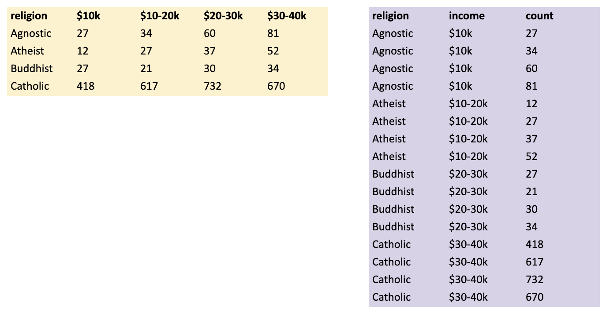

class: titleSlide, hide_logo

```{r setup, include=FALSE}
library(tidyverse)
library(xaringan)
library(xaringanExtra)
library(xaringanthemer)
library(here)
library(sysfonts)
library(showtext)
library(countdown)

options(scipen=999)

options(htmltools.dir.version = FALSE)
knitr::opts_chunk$set(
  fig.width=9, fig.height=3.5, fig.retina=3,
  out.width = "100%",
  cache = FALSE,
  echo = TRUE,
  message = FALSE, 
  warning = FALSE,
  hiline = TRUE
)
```

```{r xaringan-panelset, echo=FALSE}
xaringanExtra::use_panelset()
```

```{r xaringan-editable, echo=FALSE}
xaringanExtra::use_editable(expires = 1)
```

```{r xaringan-extra-styles, echo=FALSE}
xaringanExtra::use_extra_styles(
  hover_code_line = TRUE,         #<<
  mute_unhighlighted_code = TRUE  #<<
)
```

```{r xaringanExtra-clipboard, echo=FALSE}
xaringanExtra::use_clipboard()
```

```{r share-again, echo=FALSE}
xaringanExtra::use_share_again()
xaringanExtra::style_share_again(share_buttons="none")
```

```{r xaringan-themer, include=FALSE, warning=FALSE, eval=T}
style_duo_accent(
  primary_color = "#1f9ac9",
  secondary_color = "#444444",
  header_font_google = google_font("Source Sans Pro"),
  text_font_google   = google_font("Libre Franklin", "300", "300i"),
  code_font_google   = google_font("Anonymous Pro"),
  base_font_size = "30px",
  text_font_size = "1rem",
  header_h1_font_size = "2.5rem",
  header_h2_font_size = "2rem",
  header_h3_font_size = "1.25rem",
  padding = "8px 32px 8px 32px",
)

font_add_google("Poppins", "Poppins")
font_add_google("Libre Franklin", "Frank")
showtext_auto()
```

```{r xaringan-logo, echo=FALSE, eval=FALSE}
xaringanExtra::use_logo(
  image_url = "logo.png"
)
```

# Data Wrangling

## Tidy data

<br>
<center></center>

---
class: left, hide-count

## Tidy data

1. Each variable must have its own column.
2. Each observation must have its own row.
3. Each value must have its own cell.

<center></center>
---
class: left, hide-count

### Why tidy?

1. Consistent storage format makes it easier to work with tools that understand this format (e.g., the tidyverse).
2. Variables in columns makes it easy to do many operations in R that are vectorized (i.e., operate on vectors of values)

---

class: left, hide-count

### Application

* Return to the [DPS COVID Dashboard](https://www.dpsnc.net/Page/5339) I introduced last session. This [link](https://docs.google.com/spreadsheets/d/1kQ35JKpk3vNaM7ZfFK2DFb1B9kQIQ4IODr7lOM394nQ/edit?usp=sharing) will jump you straight to the Google Sheet with the underlying data. Open the `dps.Rmd` file in `wrangling2`.
* Complete steps 1-4
* For step 4: In Google Sheets use File > Make a Copy to make a copy of the sheet in your Google Drive account. Then create a new sheet in this copy and design a tidy version of this dataset. It's not essential that you capture all of the values, just enough to show your idea. 

---
class: left, hide-count

### Reshaping is hard in any language

.pull-left[

<blockquote class="twitter-tweet"><p lang="en" dir="ltr">When I get too full of myself with my book, it is good to have a comforting reminder from <a href="https://twitter.com/Stata?ref_src=twsrc%5Etfw">@Stata</a> that no matter how successful I am, I will still have to type &quot;help reshape&quot; every single time.</p>&mdash; ProfEmilyOster (@ProfEmilyOster) <a href="https://twitter.com/ProfEmilyOster/status/1128384932093599744?ref_src=twsrc%5Etfw">May 14, 2019</a></blockquote> <script async src="https://platform.twitter.com/widgets.js" charset="utf-8"></script>

]
.pull-right[
<blockquote class="twitter-tweet"><p lang="en" dir="ltr">successfully used pivot_longer() for the first time and had no errors AMA <a href="https://twitter.com/hashtag/rstats?src=hash&amp;ref_src=twsrc%5Etfw">#rstats</a></p>&mdash; Andrew Heiss (@andrewheiss) <a href="https://twitter.com/andrewheiss/status/1174167010974019584?ref_src=twsrc%5Etfw">September 18, 2019</a></blockquote> <script async src="https://platform.twitter.com/widgets.js" charset="utf-8"></script>
]

---
class: left, hide-count

### Watch out for legacy code

When looking for help reshaping data, you will likely find references to `melt()`/`dcast()` (a reference to melting and casting metal, aka naming stuff is hard) and `gather()`/`spread()`. Go with `pivot_longer()`/`pivot/wider()`.

---
class: left, hide-count

### `pivot_longer()`

When column names contain values, you need to pivot longer:

<center></center>

---
class: left, hide-count

### String data in column names

How many variables do you see?

```{r}
relig_income
```

---
class: left, hide-count

### Make a plan to pivot longer

```{r, echo=FALSE}

```
---
class: left, hide-count

### Tidy with `pivot_longer()`

.panelset[
.panel[.panel-name[Code]

`income` and `count` are new variables, so surround them with quotes. Could have picked any names.

```{r, eval=FALSE, echo=TRUE}
relig_income %>% 
  pivot_longer(!religion,            # which columns to pivot?
               names_to = "income",  # new variable name for income brackets
               values_to = "count")  # new variable name for counts
```
]

.panel[.panel-name[Result]
```{r, eval=TRUE, echo=FALSE}
relig_income %>% 
  pivot_longer(!religion, names_to = "income", values_to = "count")
```
]
]
---
class: left, hide-count

### Numeric data in column names

```{r}
billboard
```

---
class: left, hide-count

### Tidy with `pivot_longer()`

.panelset[
.panel[.panel-name[Think First]
```{r, eval=FALSE, echo=TRUE}
billboard %>% 
  pivot_longer(
    cols = ___, 
    names_to = "week", 
    values_to = "rank",
    values_drop_na = TRUE
  )
```

]
.panel[.panel-name[Code]
```{r, eval=FALSE, echo=TRUE}
billboard %>% 
  pivot_longer(
    cols = starts_with("wk"), 
    names_to = "week", 
    values_to = "rank",
    values_drop_na = TRUE
  )
```

]

.panel[.panel-name[Results]
```{r, eval=TRUE, echo=FALSE}
billboard %>% 
  pivot_longer(
    cols = starts_with("wk"), 
    names_to = "week", 
    values_to = "rank",
    values_drop_na = TRUE
  )
```

]

]

---
class: left, hide-count

### `week` is a string, but we want a dbl

.panelset[
.panel[.panel-name[Code]
```{r, eval=FALSE, echo=TRUE}
billboard %>% 
  pivot_longer(
    cols = starts_with("wk"), 
    names_to = "week", 
    values_to = "rank",
    values_drop_na = TRUE
  ) %>%
  mutate(week = stringr::str_remove(week, "wk"),
         week = as.numeric(week))
```

]
.panel[.panel-name[Results]
```{r, eval=TRUE, echo=FALSE}
billboard %>% 
  pivot_longer(
    cols = starts_with("wk"), 
    names_to = "week", 
    values_to = "rank",
    values_drop_na = TRUE
  ) %>%
  mutate(week = stringr::str_remove(week, "wk"),
         week = as.numeric(week))
```

]
]
---
class: left, hide-count

### When we get to strings, we'll tackle more complex patterns

```{r}
who
```

---
class: left, hide-count

### `pivot_wider()`

When observations are scattered across rows, use `pivot_wider()`:

<center></center>


---
class: left, hide-count

### Long(er) formats are often good for plotting and certain models

```{r, echo=FALSE}
set.seed(8675309)
long <- tibble(
  pid = c(rep(seq(1, 20, 1), 4)),
  round = c(rep("r_1", 20),
            rep("r_2", 20),
            rep("r_3", 20),
            rep("r_4", 20)),
  group = rep(c(rep("treatment", 10),
                rep("control", 10)),
              4),
  high_risk = rep(c(rep("Yes", 5),
                    rep("No", 5)),
                  8),
  score = c(sample(7:10, 10, replace = TRUE),
            sample(0:6, 10, replace = TRUE),
            sample(3:10, 10, replace = TRUE),
            sample(0:6, 10, replace = TRUE),
            sample(8:10, 10, replace = TRUE),
            sample(0:6, 10, replace = TRUE),
            sample(5:9, 10, replace = TRUE),
            sample(0:6, 10, replace = TRUE)
            )
)
```
```{r, echo=FALSE}
long
```

---
class: left, hide-count

### Long(er) formats are often good for plotting and certain models

```{r}
long %>%
  ggplot(aes(x=round, y=score, fill=group)) +
    geom_col(position = "dodge") + facet_wrap(~high_risk) + theme_bw()
```
---
class: left, hide-count

### Sometimes you might want to pivot wider

.panelset[
.panel[.panel-name[Think First]
```{r, eval=FALSE, echo=TRUE}
long %>%
  pivot_wider(names_from = ____, 
              values_from = _____) 
```

]
.panel[.panel-name[Code]

```{r, eval=FALSE, echo=TRUE}
long %>%
  pivot_wider(names_from = round, 
              values_from = score) 
```

]
.panel[.panel-name[Results]

```{r, eval=TRUE, echo=FALSE}
long %>%
  pivot_wider(names_from = round, 
              values_from = score) 
```

]
]


---
class: left, hide-count

# Credits

Deck by Eric Green ([@ericpgreen](https://twitter.com/ericpgreen)), licensed under Creative Commons Attribution [CC BY-SA 4.0](https://creativecommons.org/licenses/by-sa/4.0/)

* {[`xaringan`](https://github.com/yihui/xaringan)} for slides with help from {[`xaringanExtra`](https://github.com/gadenbuie/xaringanExtra)} 
* [R for Data Science](https://r4ds.had.co.nz/index.html), by Wickham and Grolemund 
