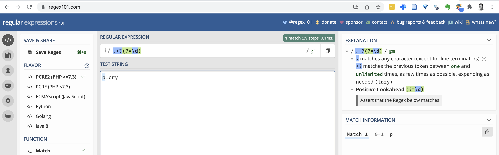

class: titleSlide, hide_logo

```{r setup, include=FALSE}
library(tidyverse)
library(xaringan)
library(xaringanExtra)
library(xaringanthemer)
library(here)
library(sysfonts)
library(showtext)
library(countdown)

options(scipen=999)

options(htmltools.dir.version = FALSE)
knitr::opts_chunk$set(
  fig.width=9, fig.height=3.5, fig.retina=3,
  out.width = "100%",
  cache = FALSE,
  echo = TRUE,
  message = FALSE, 
  warning = FALSE,
  hiline = TRUE
)
```

```{r xaringan-panelset, echo=FALSE}
xaringanExtra::use_panelset()
```

```{r xaringan-editable, echo=FALSE}
xaringanExtra::use_editable(expires = 1)
```

```{r xaringan-extra-styles, echo=FALSE}
xaringanExtra::use_extra_styles(
  hover_code_line = TRUE,         #<<
  mute_unhighlighted_code = TRUE  #<<
)
```

```{r xaringanExtra-clipboard, echo=FALSE}
xaringanExtra::use_clipboard()
```

```{r share-again, echo=FALSE}
xaringanExtra::use_share_again()
xaringanExtra::style_share_again(share_buttons="none")
```

```{r xaringan-themer, include=FALSE, warning=FALSE, eval=T}
style_duo_accent(
  primary_color = "#1f9ac9",
  secondary_color = "#444444",
  header_font_google = google_font("Source Sans Pro"),
  text_font_google   = google_font("Libre Franklin", "300", "300i"),
  code_font_google   = google_font("Anonymous Pro"),
  base_font_size = "30px",
  text_font_size = "1rem",
  header_h1_font_size = "2.5rem",
  header_h2_font_size = "2rem",
  header_h3_font_size = "1.25rem",
  padding = "8px 32px 8px 32px",
)

font_add_google("Poppins", "Poppins")
font_add_google("Libre Franklin", "Frank")
showtext_auto()
```

```{r xaringan-logo, echo=FALSE, eval=FALSE}
xaringanExtra::use_logo(
  image_url = "logo.png"
)
```

# Data Wrangling

## Strings

<br>
<center></center>

---
class: left, hide-count

### Me, every time I work with strings. Every time.

<center></center>

---

class: newTopicSub, hide_logo

# Why do we care?

---

class: left, hide_logo

### Cleaning data

.panelset[
.panel[.panel-name[Dirty]
```{r}
df <- tibble(country = c("Kenya", 
                         "Kennya", 
                         "kenya"))
df
```
]
.panel[.panel-name[Clean]
```{r}
df %>%
  mutate(country = str_to_lower(country, 
                                locale = "en"),
         country = case_when(
           country == "kennya" ~ "kenya",
           TRUE ~ country
         ))
```
]
]

---

class: left, hide_logo

### Transforming data

.panelset[
.panel[.panel-name[Original names]
```{r}
df <- tibble(p1cry = c("y", "n", "y"),
             p2eat = c("y", "y", "y"),
             p3sleep = c("y", "y", "n"))
df
```
]
.panel[.panel-name[Transformed names 1]
```{r}
df %>%
  setNames(str_replace(names(.), ".+?(?=\\d)", "phq"))
```
]

.panel[.panel-name[Transformed names 2]
```{r}
df %>%
  setNames(str_replace(names(.), ".+?(?=\\d)", "phq")) %>%
  setNames(str_replace(names(.), "(.*\\d)(.*)", "\\1_\\2"))
```
]
]

---
class: left, hide_logo

### Text mining

```{r tidytext, echo=FALSE}
knitr::include_url("https://www.tidytextmining.com/", height='90%')
```

---

class: left, hide_logo

### Get help from sites like regex101

```{r regex, echo=FALSE}

```

---
class: left, hide-count

### `RegExplain` RStudio Addin

<center></center>

---
class: left, hide-count

### `RegExplain` RStudio Addin

```{r, eval=FALSE}
devtools::install_github("gadenbuie/regexplain")
```

---
class: left, hide-count

### Things to know about strings

* You can create strings with either single quotes or double quotes. Use `"` unless `'quoting a "quote"'`.
* Escape (button) a bad situation: prompt stuck at `+`
* Escape (`\` slash) special characters: `c("\"", "\\")`

---
class: left, hide-count

### `stringr` package

<br>
<center></center>

---
class: left, hide-count

### 7 main verbs (functions)

```{r}
x <- c("why", "video", "cross", "extra", "deal", "authority")
```

---
class: left, hide-count

### `str_detect(x, pattern)`

tells you if there’s any match to the pattern

```{r}
x
str_detect(x, "[aeiou]")
```

---
class: left, hide-count

### `str_count(x, pattern)`

counts the number of patterns

```{r}
x
str_count(x, "[aeiou]")
```

---
class: left, hide-count

### `str_subset(x, pattern)`

extracts the matching components

```{r}
x
str_subset(x, "[aeiou]")
```


---

class: left, hide-count

### `str_locate(x, pattern)`

gives the position of the match

```{r}
x
str_locate(x, "[aeiou]")
```

---

class: left, hide-count

### `str_extract(x, pattern)`

extracts the text of the match

```{r}
x
str_extract(x, "[aeiou]")
```
---

class: left, hide-count

### `str_match(x, pattern)`

extracts parts of the match defined by parentheses

```{r}
x
# extract the characters on either side of the vowel
str_match(x, "(.)[aeiou](.)")
```

---

class: left, hide-count

### `str_replace(x, pattern, replacement)`

replaces the matches with new text

```{r}
x
str_replace(x, "[aeiou]", "?")
str_replace_all(x, "[aeiou]", "?")
```


---

class: left, hide-count

### `str_split(x, pattern)`

splits up a string into multiple pieces

```{r}
x
str_split(c("a,b", "c,d,e"), ",")
```

---

class: newTopicSub, hide_logo

# Over to RStudio to exercise


---
class: left, hide-count

# Credits

Deck by Eric Green ([@ericpgreen](https://twitter.com/ericpgreen)), licensed under Creative Commons Attribution [CC BY-SA 4.0](https://creativecommons.org/licenses/by-sa/4.0/)

* {[`xaringan`](https://github.com/yihui/xaringan)} for slides with help from {[`xaringanExtra`](https://github.com/gadenbuie/xaringanExtra)} 
* [R for Data Science](https://r4ds.had.co.nz/index.html), by Wickham and Grolemund 
* {[`stringr`](https://stringr.tidyverse.org/)} package
* [Albert Kim's tutorial](https://rstudio-pubs-static.s3.amazonaws.com/74603_76cd14d5983f47408fdf0b323550b846.html) adapted from STAT545 materials
