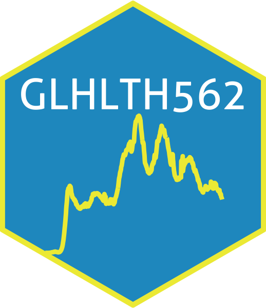
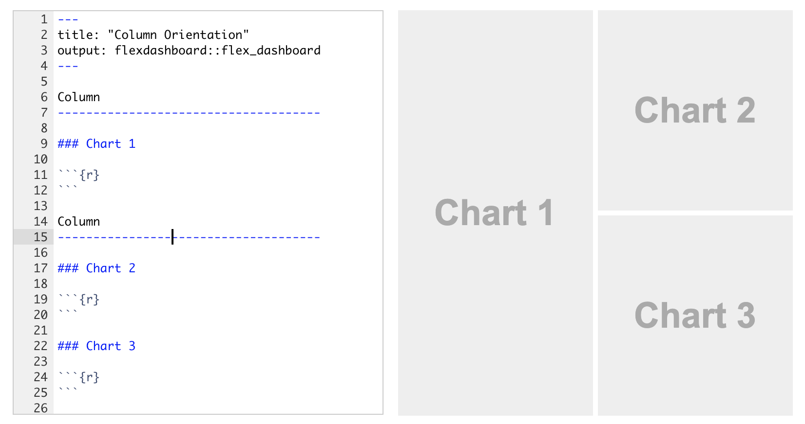

class: titleSlide, hide_logo

```{r setup, include=FALSE}
library(tidyverse)
library(xaringan)
library(xaringanExtra)
library(xaringanthemer)
library(here)
library(sysfonts)
library(showtext)
library(countdown)
library(lubridate)
library(patchwork)
library(socviz)
library(gapminder)
library(palmerpenguins)

options(htmltools.dir.version = FALSE)
knitr::opts_chunk$set(
  fig.width=9, fig.height=3.5, fig.retina=3,
  out.width = "100%",
  cache = FALSE,
  echo = TRUE,
  message = FALSE, 
  warning = FALSE,
  hiline = TRUE
)
```

```{r xaringan-panelset, echo=FALSE}
xaringanExtra::use_panelset()
```

```{r xaringan-editable, echo=FALSE}
xaringanExtra::use_editable(expires = 1)
```

```{r xaringan-extra-styles, echo=FALSE}
xaringanExtra::use_extra_styles(
  hover_code_line = TRUE,         #<<
  mute_unhighlighted_code = TRUE  #<<
)
```

```{r xaringanExtra-clipboard, echo=FALSE}
xaringanExtra::use_clipboard()
```

```{r share-again, echo=FALSE}
xaringanExtra::use_share_again()
xaringanExtra::style_share_again(share_buttons="none")
```

```{r xaringan-themer, include=FALSE, warning=FALSE, eval=T}
style_duo_accent(
  primary_color = "#1f9ac9",
  secondary_color = "#444444",
  header_font_google = google_font("Source Sans Pro"),
  text_font_google   = google_font("Libre Franklin", "300", "300i"),
  code_font_google   = google_font("Anonymous Pro"),
  base_font_size = "30px",
  text_font_size = "1rem",
  header_h1_font_size = "2.5rem",
  header_h2_font_size = "2rem",
  header_h3_font_size = "1.25rem",
  padding = "8px 32px 8px 32px",
)

font_add_google("Poppins", "Poppins")
font_add_google("Libre Franklin", "Frank")
showtext_auto()
```

```{r xaringan-logo, echo=FALSE, eval=FALSE}
xaringanExtra::use_logo(
  image_url = "logo.png"
)
```

# Communicating data science

## Websites and dashboards

<br>
<center></center>

---

class: newTopicSub, hide_logo

# Websites

---
class: left, hide_logo, hide-count

## Websites

* **Option 1**: [Rmarkdown site generator](https://bookdown.org/yihui/rmarkdown/rmarkdown-site.html)
* **Option 2**: [Blogdown](https://bookdown.org/yihui/blogdown/) (but start [here](https://www.apreshill.com/blog/2020-12-new-year-new-blogdown/))
* **Option 3**: [Distill](https://rstudio.github.io/distill/) (we'll focus on Distill)

---
class: left, hide_logo, hide-count

## Install Distill

Start by installing the package:

```
install.packages("distill")
```

---
class: left, hide_logo, hide-count

## Create a Distill website

Create a new project of type Distill website (blog is also an option)

```{r}
  knitr::include_graphics("https://rstudio.github.io/distill/images/create-website.png")
```

In your chosen directory you'll see `_site.yml`, `index.Rmd`, and `about.Rmd`

---
class: left, hide_logo, hide-count

## Build your site

```{r}
  knitr::include_graphics("https://rstudio.github.io/distill/images/build-website.png")
```

This renders your Rmd files to html into a subfolder called `_site` by default.

---
class: left, hide_logo, hide-count

## Apply a basic theme

```
create_theme(name = "theme") 
```

Then add `theme: theme.css` to your YAML in `_site.yml`:

```
name: "distill"
title: "Distill for R Markdown"
theme: theme.css
navbar:
```

---
class: left, hide_logo, hide-count

## Create a new article (page)

Make a copy of `About.Rmd` and edit it (or copy over `penguins.Rmd`):

````
---
title: "Penguins are cool"
description: |
  You need to check this out
---

```{r, include=FALSE}
knitr::opts_chunk$set(echo = FALSE)
```

# Penguins

Did you know that penguins come in different shapes and sizes?
````

---
class: left, hide_logo, hide-count

## Add the page to the navbar in `_site.yml`

```
name: "distill"
title: "My Website"
description: |
  My Website
output_dir: "_site"
navbar:
  right:
    - text: "Home"
      href: index.html
    - text: "About"
      href: about.html
    - text: "Cool stuff"
      menu:
        - text: "Flippers!"
          href: penguins.html
output: distill::distill_article
```

---
class: left, hide_logo, hide-count

## Add another page

Repeat the steps above, or copy over `tables.Rmd`.

```
navbar:
  right:
    - text: "Home"
      href: index.html
    - text: "About"
      href: about.html
    - text: "Cool stuff"
      menu:
        - text: "Flippers!"
          href: penguins.html
        - text: "Tables!"
          href: tables.html
```

---
class: left, hide_logo, hide-count

## Build again

```{r}
  knitr::include_graphics("https://rstudio.github.io/distill/images/build-website.png")
```

---
class: left, hide_logo, hide-count

## Publishing options

It's as simple as sticking your `_site` folder on a web server. There are several quick options that don't require much knowledge.

1. Github pages
2. Netlify

---
class: left, hide_logo, hide-count

## Netlify

Sign up for a free account and choose the option to deploy a new site manually.

`https://app.netlify.com/drop`

Drag your `_site` folder onto Netlify.

`https://kaleidoscopic-croquembouche-8ac74a.netlify.app/`

Custom domains are only a few credit card transactions away.

---

class: newTopicSub, hide_logo

# Dashboards

1. Shiny
2. Flexdashboard
3. Flexdashboard + Shiny

---
class: left, hide_logo, hide-count

## Install Flexdashboard

Start by installing the package:

```
install.packages("flexdashboard")
```

---
class: left, hide_logo, hide-count

## Start a new dashboard

Open `communicating2.Rproj` then open a new Rmarkdown file from a template:

```{r, echo=FALSE}
knitr::include_graphics("https://pkgs.rstudio.com/flexdashboard/reference/figures/NewRMarkdown.png")
```

---
class: left, hide_logo, hide-count

## Knit straight away

```{r, echo=FALSE}

```

---
class: left, hide_logo, hide-count

## Add packages to your setup chunk

```
library(shiny)
library(shinyWidgets)
library(palmerpenguins)
library(tidyverse)
```

---
class: left, hide_logo, hide-count

## Add `runtime: shiny` to your YAML

```
---
title: "Untitled"
output: 
  flexdashboard::flex_dashboard:
    orientation: columns
    vertical_layout: fill
runtime: shiny
---
```

---
class: left, hide_logo, hide-count

## Add a new column with `Column {.sidebar}`

Add this just after the chunk where you load packages

````
Column {.sidebar}
-----------------------------------------------------------------------

````

---
class: left, hide_logo, hide-count

## Add a `palmerpenguins` example plot to Chart A

```
ggplot(data = penguins, aes(x = species, y = flipper_length_mm)) +
    geom_boxplot(aes(color = species), width = 0.3, show.legend = FALSE) +
    geom_jitter(aes(color = species), alpha = 0.5, show.legend = FALSE, 
                position = position_jitter(width = 0.2, seed = 0)) +
    scale_color_manual(values = c("darkorange","purple","cyan4")) +
    theme_minimal() +
    labs(x = "Species",
         y = "Flipper length (mm)")
```

---
class: left, hide_logo, hide-count

## Wrap your plot in `renderPlot({PLOT CODE})`

```
renderPlot({
  ggplot(data = penguins, aes(x = species, y = flipper_length_mm)) +
    geom_boxplot(aes(color = species), width = 0.3, show.legend = FALSE) +
    geom_jitter(aes(color = species), alpha = 0.5, show.legend = FALSE, 
                position = position_jitter(width = 0.2, seed = 0)) +
    scale_color_manual(values = c("darkorange","purple","cyan4")) +
    theme_minimal() +
    labs(x = "Species",
         y = "Flipper length (mm)")
})
```

---
class: left, hide_logo, hide-count

## Add a slider input

Add this to a code chunk in the sidebar section

```
sliderInput("alpha_level", label = "Alpha:",
            min = 0, max = 1, step = 0.2, value = 1)
```

---
class: left, hide_logo, hide-count

## Replace alpha value with input

`alpha = input$alpha_level`

```
geom_jitter(aes(color = species), alpha = input$alpha_level, 
                show.legend = FALSE, 
                position = position_jitter(width = 0.2, seed = 0))
```

---
class: left, hide_logo, hide-count

## Deploying dashboard

Similar to distill for regular flexdashboards. Must have shiny server if incorporating shiny app.

---
class: left

# Credits

Deck by Eric Green ([@ericpgreen](https://twitter.com/ericpgreen)), licensed under Creative Commons Attribution [CC BY-SA 4.0](https://creativecommons.org/licenses/by-sa/4.0/)
* {[`xaringan`](https://github.com/yihui/xaringan)} for slides with help from {[`xaringanExtra`](https://github.com/gadenbuie/xaringanExtra)}
