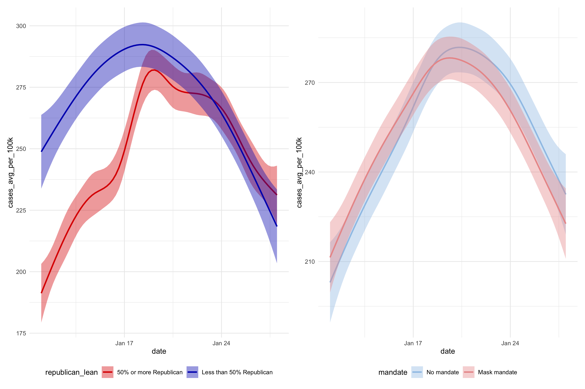

```{r setup, include=FALSE, warning = FALSE, message = FALSE}
  knitr::opts_chunk$set(echo = TRUE, warning = FALSE, message = FALSE)
  options(scipen=999) # turns off scientific notation
  
  library(tidyverse)
  library(googlesheets4)
    gs4_deauth()
  library(eeptools)
  library(snakecase)
  library(lubridate)
  library(patchwork)
  library(stringr)
```

What can we say about mask mandates and SARS-CoV-2 transmission at the county level? That's our motivating question. In exploring this question, you'll have an opportunity to put your accumulated R knowledge to work. You'll import data, join tables, transform variables, work with strings and factors, and more.

# Data

Please consult [this directed acyclic graph](http://dagitty.net/dags.html?id=2Zk3dJ) (DAG) to understand what data you need to obtain. Never heard of DAGs? Consider [watching this excellent talk](https://www.youtube.com/watch?v=KNPYUVmY3NM) by Richard McElreath, author of ["Statistical Rethinking"](https://xcelab.net/rm/statistical-rethinking/). Fair warning: it's going to make you question every analysis you've ever run. It's optional viewing.

```{r dagpng, echo=FALSE}
  
```
<br>

DAGs can help you be clear on what you need to adjust for based on your assumptions. I know, your prior approach might have been to adjust for everything. That's common. Kitchen sink regressions. McElreath will have you re-thinking this strategy.

This DAG represents MY assumptions about the causal link between mask mandates, cases, and hospitalizations. I decided on the variables and drew the arrows. The logic of DAGs determined the minimal adjustment set for causal effect identification.

This DAG tells us that to estimate the total effect of mask mandates on cases/hospitalizations, we only need to adjust for political affiliation. To understand why this is the minimal adjustment set in the logic of DAGs, you'd need to read up on DAGs or watch the video. **That's not necessary** unless you want to draw your own DAG. I don't think that's necessary because the primary learning goal here is the pre-inference data wrangling.

```{r dag, eval=FALSE, echo=FALSE}
# you can use the code from dagitty.net to draw DAGs in R
# library(ggdag)
# library(dagitty)

  model_dagitty <- dagitty('dag{
bb="0,0,1,1"
"age composition" [pos="0.738,0.231"]
"mask mandate" [exposure,pos="0.249,0.423"]
"mask wearing" [pos="0.421,0.426"]
"peak cases of Omicron wave" [outcome,pos="0.613,0.427"]
"political affiliation" [pos="0.321,0.647"]
"vaccination levels" [pos="0.744,0.651"]
hospitalizations [outcome,pos="0.874,0.431"]
"age composition" -> "peak cases of Omicron wave"
"age composition" -> hospitalizations
"mask mandate" -> "mask wearing"
"mask wearing" -> "peak cases of Omicron wave"
"peak cases of Omicron wave" -> hospitalizations
"political affiliation" -> "mask mandate"
"political affiliation" -> "mask wearing"
"political affiliation" -> "vaccination levels"
"vaccination levels" -> "peak cases of Omicron wave"
"vaccination levels" -> hospitalizations
}

  ')

ggdag_status(model_dagitty, text = FALSE, use_labels = "name") +
  guides(color = FALSE) +  # Turn off legend
  theme_dag()
```

Based on this DAG, you need to get the following county-level data:

* Cases (outcome)
* Mask mandates (exposure/intervention)
* Political affiliation (covariate)

For this assignment, you will focus on the period from July 1, 2021 through the present (February 11, 2022).

```{r, echo=FALSE}
  knitr::include_graphics("img/covid.png")
```


## COVID-19 Data

There are lots of sources for COVID data, but I'd like you to use the [NY Times Github repository](https://github.com/nytimes/covid-19-data). Here's what you're looking for:

* Data at the county level
* Data that covers the July 2021 through the present time
* Data that is normalized by population (per 100,000)
* Seven-day rolling averages

You can get these files from the `rolling-averages` folder, or you can roll your own averages for extra fun. Remember, when getting the URLs for csvs on Github, you must click on the file and then click on the link or button to view the raw data. You'll know you have the correct URL if it starts with `https://raw.githubusercontent.com/nytimes/covid-19-data/master`.

## Mask Mandates

I struggled to find county-level data about mask mandates during Omicron. I started by looking nationally, but then scaled back to just North Carolina and South Carolina. I also pivoted from looking for county-wide mandates to school district mandates. Schools districts in these two states are mostly organized at the county-level, so I thought school mask mandates would be a good proxy for the county.

The [North Carolina School Boards Association](https://www.ncsba.org/2022/01/ncsba-legislative-update-january-7-2022/) has compiled [data for every county](https://docs.google.com/spreadsheets/d/1IDEnNqsrjz9R0BHu04JhSKOyEOCHVT3f6wnn6ft8CNQ/edit#gid=0). It's not in a usable format, and it doesn't include South Carolina, so I created my own version that you can access [here](https://docs.google.com/spreadsheets/d/1gPwa2xhwVvowDwBR5CS32PU7RVSryey57wBfrJ69280/edit?usp=sharing). 

[**Important**]: Mistakes are possible. I make no claims about the accuracy of my transformation of the NC data or my compilation of the SC data.]

`masksStart_1` is the date that counties announced mask mandates for the 2021-2022 school year. If blank, there was no mandate. In a few cases the exact data was not available, so the date is "2021-09-01".

If district (county) removed the mandate, you'll find a date in `masksEnd_1`. If there's no date, the mandate was still in place as of February 7, 2022.

A few districts that removed mandates subsequently reintroduced them. Where this happened you'll see a date in `masksStart_2`. A subset of these districts with values for `masksEnd_2` removed mandates again. 

[In case you're not familiar with US counties and school districts, you should know that policies for public schools are (mostly) made by school boards made up of community members who are elected.]

## Political affiliation

The [MIT Election Data + Science Lab](https://electionlab.mit.edu/data) has data on county presidential election returns from the 2020 election.

> MIT Election Data and Science Lab, 2018, "County Presidential Election Returns 2000-2020", https://doi.org/10.7910/DVN/VOQCHQ, Harvard Dataverse, V9, UNF:6:qSwUYo7FKxI6vd/3Xev2Ng== [fileUNF]

I've prepared this for you in the zip folder. Look for a file called `countypres_2000-2020.csv`.

# Objectives

Your main objective is to create a tidy dataset for North and South Carolina counties that combines data on COVID, school mask mandates, political affiliation. 

* Limit the COVID data to July 1, 2021 and after for NC and SC counties
* Calculate the timing and level of each county's peak cases (per 100,000) during the Omicron wave (i.e., when did each county peak and what was the rolling average of new cases at the peak?)
* Calculate the percentage of votes in each county for the Republican candidate in the 2020 presidential election
* Decide how to represent data on mask mandates (e.g., some counties did not have mandates, others did...some did then they didn't...and then they did again)
* Create a visualization that includes peak case information, mask mandates, and political affiliation

This work should showcase:

* data import
* data transformation with dplyr and data tidying
* joining of relational data
* working with strings and factors
* manipulating dates
* plotting with ggplot2

# Load in data

```{r load in data}
rolling_averages_21 <- read_csv("https://raw.githubusercontent.com/nytimes/covid-19-data/master/rolling-averages/us-counties-2021.csv")
rolling_averages_22 <- read_csv("https://raw.githubusercontent.com/nytimes/covid-19-data/master/rolling-averages/us-counties-2022.csv")
mask_mandates <- read_sheet("https://docs.google.com/spreadsheets/d/1gPwa2xhwVvowDwBR5CS32PU7RVSryey57wBfrJ69280/edit?usp=sharing")
political_affiliation <- read_csv("countypres_2000-2020.csv")
```

# Create tidy dataset per instructions

## Sketch final result

| state | county | peak_date | cases_per_100k_at_peak | masksStart_1 | masksEnd_1 | masksStart_2 | masksEnd_2 | republican_share_of_votes |
|:--    |:--     |:--        |:--                     |:--           |:--         |:--           |:--         |:--                        |
| <chr> | <chr> | <date> | <dbl> | <date> | <date> | <date> | <date> | dbl |

## First, rolling_averages

Used [this Stack Overflow](https://stackoverflow.com/questions/30024437/applying-group-by-and-summarise-on-data-while-keeping-all-the-columns-info) to filter to the first date when cases peaked in a county and keep the corresponding date.

```{r prep rolling_averages data frame}

# Clean 2021 data
rolling_averages_21 <- rolling_averages_21 %>%
  filter(state == "North Carolina" | state == "South Carolina") %>% # keep only Carolinas
  filter(date > "2021-06-30") %>% # keep only July 1, 2021, onwards
  select(c(date, county, state, cases_avg_per_100k)) # keep relevant columns

# Clean 2022 data
rolling_averages_22 <- rolling_averages_22 %>%
  filter(state == "North Carolina" | state == "South Carolina") %>% # keep only Carolinas
  select(c(date, county, state, cases_avg_per_100k)) # keep relevant columns

# Append 2021 and 2022 data
rolling_averages <- rolling_averages_21 %>%
  bind_rows(rolling_averages_22) # expecting 33,872 rows of 10 variables

# Clean 2021-22 data
unique(rolling_averages[c("county", "state")]) # 146
isid(rolling_averages_21, vars = c("date", "county", "state")) # TRUE, data-county-state combinations uniquely identify the data frame

rolling_averages <- rolling_averages %>%
  mutate(state = to_snake_case(state)) %>% # change to snakecase
  mutate(county = to_snake_case(county))

rm(rolling_averages_21, rolling_averages_22) # clean up environment

# Create peak_date and cases_per_100k_at_peak columns
peaks <- rolling_averages %>%
  group_by(state, county) %>%
  slice(which.max(cases_avg_per_100k)) %>%
  rename(cases_per_100k_at_peak = cases_avg_per_100k) %>%
  rename(peak_date = date)

# Fix two offending county names
peaks$county[peaks$county == "mc_cormick"] <- "mccormick"
peaks$county[peaks$county == "mc_dowell"] <- "mcdowell"
rolling_averages$county[rolling_averages$county == "mc_cormick"] <- "mccormick"
rolling_averages$county[rolling_averages$county == "mc_dowell"] <- "mcdowell"
```

## Next, mask_mandates

```{r prep mask_mandates data frame}

# Counties in mask data likely match those in COVID data
unique(mask_mandates[c("county", "state")]) # 146
isid(mask_mandates, vars = c("county", "state")) # TRUE

# Clean mask data
mask_mandates <- mask_mandates %>%
  mutate(state = to_snake_case(state)) %>% # change to snakecase
  mutate(county = to_snake_case(county)) %>%
  select(-c(geoid)) %>%
  mutate_at(vars(matches("masks")), as_date) # change cols starting with "masks" from dttm to date

# Fix two offending county names
mask_mandates$county[mask_mandates$county == "mc_cormick"] <- "mccormick"
mask_mandates$county[mask_mandates$county == "mc_dowell"] <- "mcdowell"
```

## Finally, political_affiliation

```{r prep political_affiliation data frame}

# Clean political affiliation data
political_affiliation <- political_affiliation %>%
  filter(state_po == "NC" | state_po == "SC") %>% # keep only Carolinas
  filter(year == 2020) %>% # keep only 2020 votes
  filter(party == "REPUBLICAN") %>% # keep only Republican votes
  select(c(state, county_name, candidatevotes, totalvotes)) %>% # keep relevant columns
  mutate(state = to_snake_case(state)) %>% # change to snakecase
  mutate(county_name = to_snake_case(county_name)) %>%
  rename(county = county_name)

# Counties in political affiliation data likely match those in mask and COVID data
unique(political_affiliation[c("county", "state")]) # 146

# Calculate Republican share of vote by county
# Note totalvotes already calculated by county
political_affiliation <- political_affiliation %>%
  group_by(state, county) %>%
  summarize(republicanvotes = sum(candidatevotes), totalvotes = mean(totalvotes)) %>% # sum candidatevotes by county; keep totalvotes with mean()
  mutate(republican_share_of_votes = republicanvotes/totalvotes) %>% # Republican share of total votes in county
  select(c(state, county, republican_share_of_votes)) # keep relevant columns
```

## Join three data frames

```{r join data frames}

# Two joins
peaks_mandates <- full_join(peaks, mask_mandates, by = c("state", "county"))
tidy_masks <- full_join(peaks_mandates, political_affiliation, by = c("state", "county"))

# Reorder columns
tidy_masks <- tidy_masks %>%
  relocate(county, peak_date, .after = state)

# Clean up environment
rm(peaks_mandates)
```

# Create data viz

I first created two new columns, "mandate" and "republican_lean." I defined having a mask mandate during Omicron as either:

* Having a 1st mask mandate that predated the county's Omicron peak by 7 days and never getting rid of it
* Having a 2nd mask mandate that predated the county's Omicron peak by 7 days and never getting rid of it
* Having a 1st mask mandate that predated the county's Omicron peak by 7 days and ended 7 days after the county's Omicron peak
* Having a 2st mask mandate that predated the county's Omicron peak by 7 days and ended 7 days after the county's Omicron peak

I defined a Republican-leaning county as having at least 50% votes for the Republican presidential candidate in 2020.

```{r create new columns for data viz}
# Create mask_mandate column
tidy_masks <- tidy_masks %>%
  mutate(mandate = ifelse(
    (masksStart_1 < peak_date - 7 & is.na(masksEnd_1)) |
      (masksStart_2 < peak_date - 7 & is.na(masksEnd_2)) |
      (masksStart_1 < peak_date - 7 & masksEnd_1 > peak_date + 7) |
      (masksStart_2 < peak_date - 7 & masksEnd_2 > peak_date + 7),
    "Mask mandate",
    "No mandate")
  ) %>%
  mutate(mandate = replace_na(mandate, "No mandate"))

tidy_masks$mandate <- factor(tidy_masks$mandate, levels = c("No mandate", "Mask mandate"))

# Create republican_lean column
tidy_masks <- tidy_masks %>%
  mutate(republican_lean = ifelse(
    republican_share_of_votes < 0.5,
    "Less than 50% Republican",
    "50% or more Republican"))
```

```{r peak data viz}
p1 <- ggplot(tidy_masks,
             aes(x = peak_date, 
                 y = cases_per_100k_at_peak,
                 color = mandate,
                 fill = mandate)) + 
  geom_jitter(alpha = 0.5) +
  geom_smooth() +
  scale_color_manual(values = c("#ea9999", "#9fc5e8"), labels = c("Counties with no mask mandate", "Counties with mask mandate")) +
  scale_fill_manual(values = c("#ea9999", "#9fc5e8"), labels = c("Counties with no mask mandate", "Counties with mask mandate")) +
  labs(x = "Date cases peaked in a county",
       y = "Height of each county's Omicron peak\n(cases per 100k)",
       color = "Mask mandates during Omicron wave",
       fill = "Mask mandates during Omicron wave") +
  scale_x_date(date_breaks = "1 week", date_labels = "%b %d", limits = as.Date(c("2022-01-10", "2022-01-28"))) +
  scale_y_continuous(breaks = seq(100, 650, 100)) +
  theme_minimal() +
  theme(legend.position = "bottom",
        legend.justification = "left",
        legend.direction = "vertical",
        legend.title = element_text(size=10),
        legend.text = element_text(size=10))

p2 <- ggplot(tidy_masks,
             aes(x = peak_date, 
                 y = cases_per_100k_at_peak,
                 color = republican_lean,
                 fill = republican_lean)) + 
  geom_jitter(alpha = 0.5) +
  geom_smooth() +
  scale_color_manual(values = c("#de0100", "#0015bc"), labels = c("Counties that voted at least 50% Republican", "Counties that voted less than 50% Republican")) +
  scale_fill_manual(values = c("#de0100", "#0015bc"), labels = c("Counties that voted at least 50% Republican", "Counties that voted less than 50% Republican")) +
  labs(x = "Date cases peaked in a county",
       y = "",
       color = "Republican votes in the 2020 presidential election",
       fill = "Republican votes in the 2020 presidential election") +
  scale_x_date(date_breaks = "1 week", date_labels = "%b %d", limits = as.Date(c("2022-01-10", "2022-01-28"))) +
  scale_y_continuous(breaks = seq(100, 650, 100)) +
  theme_minimal() +
  theme(legend.position = "bottom",
        legend.justification = "left",
        legend.direction = "vertical",
        legend.title = element_text(size=10),
        legend.text = element_text(size=10))

p1 + p2 +
  plot_annotation(title = "Carolina counties with no mask mandate had higher Omicron peaks",
                  subtitle = "Republican counties were responsible for some of the highest and some of the lowest peaks. Republican-minority counties peaked at similar levels to one another.",
                  caption = "Data: NY Times, North Carolina School Boards Association, and MIT Election Data & Science Lab ") &
  theme(plot.title = element_text(size = 16))

ggsave("p1_p2.png", width = 12, height = 8)


```

I like how my plot came out! One worry I have, though, is that as soon as I see an x-axis with time on it and some smooth lines, I assume I'm looking at longitudinal data -- such as daily cases over time. This plot is different -- I'm smoothing lines over multiple counties' peaks. It feels a little bit unintuitive for a reader. *Just as an experiment*, I tried plotting daily cases, averaged across groups of counties: those with and without mask mandates, and those voting majority Republican and not. I thought this might be a little more intuitive to understand. These plots should not look like my previous one because I'm not plotting peaks; I'm plotting daily cases. These plots, perhaps like the original tweet that inspired Dr. Green, don't really reveal that much variation between the groups of counties we're interested in. If we were to just look at these plots, we might conclude that masks didn't do much.

```{r daily data viz}
# Create a version of tidy_masks that preserves the original daily rolling averages from the rolling_averages data frame
tidy_masks_daily <- full_join(rolling_averages, tidy_masks, by = c("state", "county"))

# Fit to same 
january <- tidy_masks_daily %>%
  filter(date >= "2022-01-11" & date <= "2022-01-28")

p3 <- ggplot(january,
             aes(x = date, 
                 y = cases_avg_per_100k,
                 color = republican_lean,
                 fill = republican_lean)) +
  geom_smooth() +
  scale_color_manual(values = c("#de0100", "#0015bc")) +
  scale_fill_manual(values = c("#de0100", "#0015bc")) +
  theme_minimal() +
  theme(legend.position = "bottom")

p4 <- ggplot(january,
             aes(x = date, 
                 y = cases_avg_per_100k,
                 color = mandate,
                 fill = mandate)) +
  geom_smooth() +
  scale_color_manual(values = c("#9fc5e8", "#ea9999")) +
  scale_fill_manual(values = c("#9fc5e8", "#ea9999")) +
  theme_minimal() +
  theme(legend.position = "bottom")

p3 + p4

ggsave("p3_p4.png", width = 12, height = 8)


```
