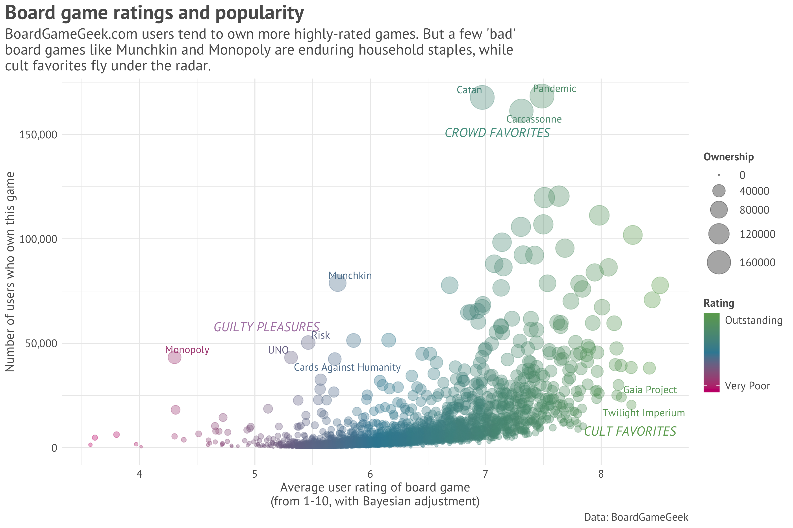
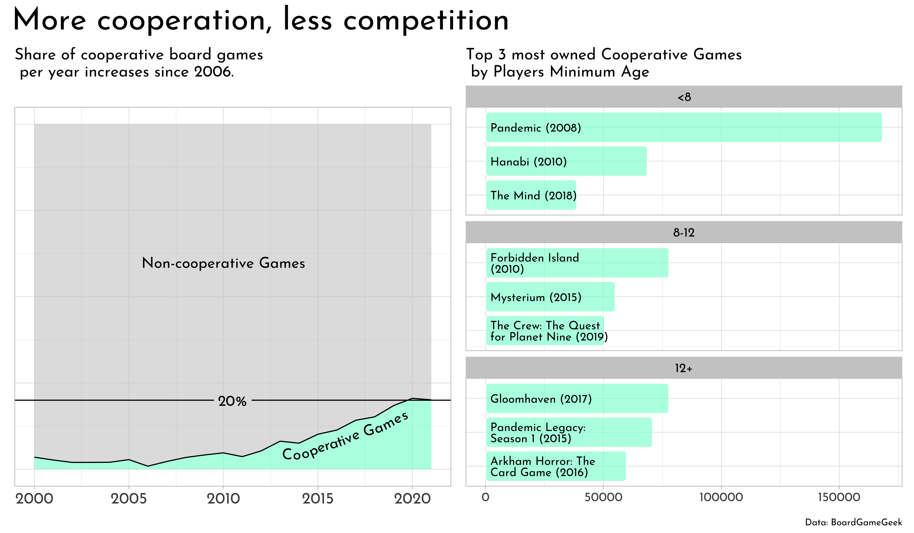

```{r setup, include = FALSE}

# load packages
  library(tidyverse)
  library(tidytuesdayR) # run install.packages("tidytuesdayR") again to get new data for this week
  library(dplyr)
  library(patchwork)
  library(eeptools) # provides the isid() function, which confirms a data frame's unique identifier
  library(ggrepel) # add labels to plots that do not overlap with other labels
  library(stringr) # to wrap text
  library(sysfonts)

# load data
  tuesdata <- tidytuesdayR::tt_load('2022-01-25')
  ratings <- tuesdata$ratings
  details <- tuesdata$details
```

# Exploration

## Data prep

```{r understand data, eval = FALSE}

# check which column(s) uniquely identify the ratings and details data frames
isid(ratings, vars = c("id")) # TRUE
isid(ratings, vars = c("num")) # TRUE
isid(details, vars = c("id")) # TRUE
isid(details, vars = c("num")) # TRUE
```

```{r data prep}
# the details data frame is a subset of the ratings data frame; there are 200 more board games in ratings with no corresponding row in details.

# merge the ratings and details data frames on id, returning all rows from ratings where there are matches in details, and all columns from both data frames
ratingsdetails <- inner_join(ratings, details, by = "id") %>%
  filter(bayes_average > 0) %>%
  select(id, name, rank, average, bayes_average, users_rated, thumbnail, owned) # select columns I'm interested in
```

## Explore data

I hypothesize a positive correlation between rating and ownership. I will use the Bayesian average rating instead of the popular average rating because I like how it does not allow ratings with few users_rated to skew the data. Here's a quick scatter plot of rating by ownership to see if anything interesting jumps out at me.

```{r exploratory scatter plot}
ggplot(ratingsdetails, aes(x=bayes_average, y=owned)) +
  geom_point()
```

Three games stand out as being both quite highly rated and enormously popular (high ownership):

* Pandemic: id = 30549, bayes_average = 7.487, owned = 168,364
* Carcassonne: id = 822, bayes_average = 7.309, owned = 161,299
* Catan: id = 13, bayes_average = 6.970, owned = 167,733


A few games stand out as being more popular than their rating would suggest:

* Monopoly: id = 1406, bayes_average = 4.304, owned = 43,316
* Cards Against Humanity: id = 50381, bayes_average = 5.692, owned = 42,450
* Munchkin: id = 1927, bayes_average = 5.717, owned = 78,849
* UNO: id = 2223, bayes_average = 5.313, owned = 43,200
* Risk: id = 181, bayes_average = 5.462, owned = 50,362


A few games stand out as being adored by the few who own them:

* Twilight Imperium: Fourth Edition: id = 233078, bayes_average = 8.262, owned = 20,542
* Gaia Project: id = 220308, bayes_average = 8.175, owned = 24,230

## Plots

```{r first attempt, fig.width = 12, fig.height = 8}
plot1 <-
  ggplot(ratingsdetails, aes(x=bayes_average, y=owned)) +
  geom_point() +
  annotate("text", x = 7.487, y = 168364, label = paste('Pandemic'), size = 5) +
  annotate("text", x = 6.970, y = 167733, label = paste('Carcassonne'), size = 5) +
  annotate("text", x = 7.309, y = 161299, label = paste('Catan'), size = 5) +
  annotate("text", x = 4.304, y = 43316, label = paste('Monopoly'), size = 5) +
  annotate("text", x = 5.692, y = 42450, label = paste('Cards Against Humanity'), size = 5) +
  annotate("text", x = 5.717, y = 78849, label = paste('Munchkin'), size = 5) +
  annotate("text", x = 8.262, y = 20542, label = paste('Twilight Imperium'), size = 5) +
  annotate("text", x = 8.175, y = 24230, label = paste('Gaia Project'), size = 5)

plot1
```

```{r second attempt, fig.width = 12, fig.height = 8}
# instead of manually positioning data labels, create a new column in ratingsdetails for the 10 board game names I want displayed, then plot that column as labels
ratingsdetails <- ratingsdetails %>%
  mutate(namelabel = 
           ifelse(
             id == 30549 |
               id == 822 |
               id == 13 |
               id == 1406 |
               id == 50381 |
               id == 1927 |
               id == 2223 |
               id == 181 |
               id == 233078 |
               id == 220308,
             name,
             "")) %>%
  mutate(namelabel = replace(namelabel, namelabel == "Twilight Imperium: Fourth Edition", "Twilight Imperium"))

# add font
font_add_google(name = "PT Sans")

# plot 10 board game names using geom_text_repel()
plot2 <-
  ggplot(ratingsdetails, aes(x=bayes_average, y=owned)) +
  geom_point(aes(color = bayes_average)) +
  scale_color_gradientn(colors = c("#c90076", "#3989a2", "#6ba85d")) +
  geom_text_repel(aes(label = namelabel,  color = bayes_average), size = 4, max.overlaps = 50, family = "PT Sans") +
  annotate("text", x = 5.1, y = 58000, label = paste('GUILTY PLEASURES'), color = "#b085b2", size = 5, family = "PT Sans", fontface = "italic") +
  annotate("text", x = 7.1, y = 154000, label = paste('CROWD FAVORITES'), color = "#539d8e", size = 5, family = "PT Sans", fontface = "italic") +
  annotate("text", x = 8.25, y = 8000, label = paste('CULT FAVORITES'), color = "#6ba85d", size = 5, family = "PT Sans", fontface = "italic") +
  theme_minimal()

plot2
```

```{r third attempt, fig.width = 12, fig.height = 8}
# try bubble plot to visualize ownership
plot3 <- 
  ggplot(ratingsdetails, aes(x=bayes_average, y=owned)) +
  geom_point(aes(color = bayes_average, size = owned), alpha = 0.35) +
  scale_color_gradientn(colors = c("#c90076", "#3989a2", "#6ba85d"),
                        name = "Rating",
                        breaks = c(4, 8.1),
                        labels = c("Very Poor", "Outstanding"),
                        guide = guide_colorbar(title.position = "top")) +
  scale_size(range = c(0.5, 12),
             name = "Ownership",
             guide = guide_legend(title.position = "top")) +
  scale_y_continuous(labels = function(x) format(x, big.mark = ",")) +
  geom_text_repel(aes(label = namelabel,  color = bayes_average), size = 4, max.overlaps = 50, family = "PT Sans") +
  annotate("text", x = 5.1, y = 58000, label = paste('GUILTY PLEASURES'), color = "#b085b2", size = 5, family = "PT Sans", fontface = "italic") +
  annotate("text", x = 7.1, y = 151000, label = paste('CROWD FAVORITES'), color = "#539d8e", size = 5, family = "PT Sans", fontface = "italic") +
  annotate("text", x = 8.25, y = 8000, label = paste('CULT FAVORITES'), color = "#6ba85d", size = 5, family = "PT Sans", fontface = "italic") +
  theme_minimal() +
  labs(title = "Board game ratings and popularity", 
       subtitle = str_wrap("BoardGameGeek.com users tend to own more highly-rated games. But a few 'bad' board games like Munchkin and Monopoly are enduring household staples, while cult favorites fly under the radar."),
       caption = "Data: BoardGameGeek",
       x = "Average user rating of board game\n(from 1-10, with Bayesian adjustment)",
       y = "Number of users who own this game") +
  theme(plot.title = element_text(color = '#5b5b5b', family="PT Sans", face = "bold", size=22),
        plot.title.position = "plot",
        plot.subtitle = element_text(color = '#5b5b5b', family="PT Sans", size=16),
        plot.caption = element_text(color = '#5b5b5b', family="PT Sans", size=12),
        axis.title.x = element_text(color = '#5b5b5b', family="PT Sans", size=14),
        axis.title.y = element_text(color = '#5b5b5b', family="PT Sans", size=14),
        axis.text.x = element_text(color = '#5b5b5b', family="PT Sans", size=12),
        axis.text.y = element_text(color = '#5b5b5b', family="PT Sans", size=12),
        legend.text = element_text(color = '#5b5b5b', family="PT Sans", size=12), 
        legend.title = element_text(color = '#5b5b5b', family="PT Sans", size=12, face = "bold"))

ggsave("boardgames.png", width = 12, height = 8)


```

# Review

## Find and run

| Name | Details |
|:--   |:--      |
| Author | Richard Vogg |
| Tweet | [url](https://twitter.com/richard_vogg/status/1487447277098651655) |
| Code | [url](https://github.com/richardvogg/tidy-tuesdays/blob/master/2022/Week%204%20-%20Games/games.R) |

```{r vogg setup}
# load in additional packages
library(tidyr)
library(patchwork)
library(ggimage)
library(geomtextpath)
library(ggchicklet)

# ratings <- readr::read_csv('https://raw.githubusercontent.com/rfordatascience/tidytuesday/master/data/2022/2022-01-25/ratings.csv')
# details <- readr::read_csv('https://raw.githubusercontent.com/rfordatascience/tidytuesday/master/data/2022/2022-01-25/details.csv')

sysfonts::font_add_google(name = "Josefin Sans", "Josefin")
showtext::showtext_auto()
```

```{r vogg coop_plot}
## More collaboration, less competition

coop_df <- details %>%
  mutate(cooperative = ifelse(str_detect(boardgamemechanic, "Cooperative"), 1, 0)) %>%
  count(cooperative, yearpublished) %>%
  filter(yearpublished >= 2000, yearpublished < 2022, !is.na(cooperative)) %>%
  add_count(yearpublished, wt = n) %>% 
  mutate(prop = n / nn)

coop_plot <- coop_df %>%
  ggplot(aes(x = yearpublished, y = prop, fill = factor(cooperative))) +
  geom_area(alpha = 0.6) +
  geom_textline(data = subset(coop_df, cooperative == 1), 
                label = "Cooperative Games", hjust = 0.9, vjust = 1.5,
                text_smoothing = 50, size = 5, family = "Josefin") +
  annotate("text", x = 2010, y = 0.6,
              label = "Non-cooperative Games", size = 5, family = "Josefin") +
  geom_texthline(yintercept = 0.2, label = "20%",  size = 5, family = "Josefin") +
  scale_fill_manual(values = c("grey80", "aquamarine")) +
  labs(subtitle = "Share of cooperative board games\n per year increases since 2006.") +
  theme_light() +
  theme(legend.position = "none",
        text = element_text(size = 15, family = "Josefin"),
        axis.text.y = element_blank(),
        axis.ticks.y = element_blank(),
        axis.title = element_blank(),
        axis.text.x = element_text(size = 15))

coop_plot
```

```{r vogg top_n_plot}
# Top 5 cooperative board games
n <- 3

top_n <- details %>%
  left_join(ratings, by = "id") %>%
  mutate(cooperative = ifelse(str_detect(boardgamemechanic, "Cooperative"), 1, 0)) %>%
  filter(yearpublished >= 2000, yearpublished < 2022, cooperative == 1) %>% 
  mutate(minage_cut = cut(minage,
                          breaks = c(0, 8, 12, 100),
                          labels = c("<8", "8-12", "12+"))) %>%
  filter(!is.na(minage_cut)) %>%
  group_by(minage_cut) %>%
  top_n(n, owned) %>%
  mutate(rank = rank(owned))

top_n_plot <- top_n %>%
  ggplot(aes(y = owned, x = reorder(str_wrap(primary, 25), owned))) + 
  geom_chicklet(fill = "aquamarine", alpha = 0.6) +
  geom_text(aes(label = str_wrap(paste0(primary, " (", yearpublished, ")"), 22), y = 0), 
            hjust = 0, nudge_y = 2000, lineheight = 0.8, family = "Josefin") +
  coord_flip() +
  theme_light() +
  facet_wrap(minage_cut~., scales = "free_y",nrow = 3) +
  labs(subtitle = "Top 3 most owned Cooperative Games\n by Players Minimum Age") +
  theme(axis.title = element_blank(),
        axis.text.y = element_blank(),
        axis.ticks.y = element_blank(),
        strip.background = element_rect(fill = "grey80"),
        strip.text = element_text(colour = "black"),
        text = element_text(size = 15))

top_n_plot
```

```{r vogg final data viz}
coop_plot + top_n_plot +
  plot_annotation(title = "More cooperation, less competition",
                  caption = "Data: BoardGameGeek") &
  theme(plot.title = element_text(size = 30),
        text = element_text(family = "Josefin"))

ggsave("voggplot.png", width = 12, height = 7)


```

## Notes

### Simple and effective choice of geoms

I like cooperative games quite a bit. Like Vogg, I was also curious about how the share of cooperative games has changed over time. I don't remember playing any as a kid in the '90s, so I was curious to see how popular cooperative games were in the early 2000s.

* I thought Vogg was right to focus on the rising _proportion_ of games that are cooperative, not just rising number of cooperative games. The geom_area() plot was a smart way to illustrate this. Also, it allowed readers to see that the large majority of games are still non-cooperative.
* Vogg used geom_texthline() to illustrate the 20% threshold to good effect.
* His faceted column plot was also very easy to understand. As a stylistic choice, Vogg used geom_chicklet() from the ggchicklet package instead of the regular geom_col() to make the columns have rounded edges (I guess because of Chicklet candies?).

### Elegant and efficient data wrangling

* Last Tidy Tuesday, I experimented wtih grepl(). I learned from Vogg that there is also str_detect(). According to [this stackoverflow thread](https://stackoverflow.com/questions/57412700/whats-the-difference-between-the-str-detect-function-in-stringer-and-grepl-and/57413821), there may be reasons to prefer str_detect() over grepl(), including speed.
* I was really impressed by how few lines of code Vogg used to create coop_df, and in particular, how he created columns for counts and proportions using 'n' and 'nn'.
* I learned how to use mutate() with cut(), breaks(), and labels() to create a new column for binning data. Very neat that that took Vogg just three lines of code.

###
