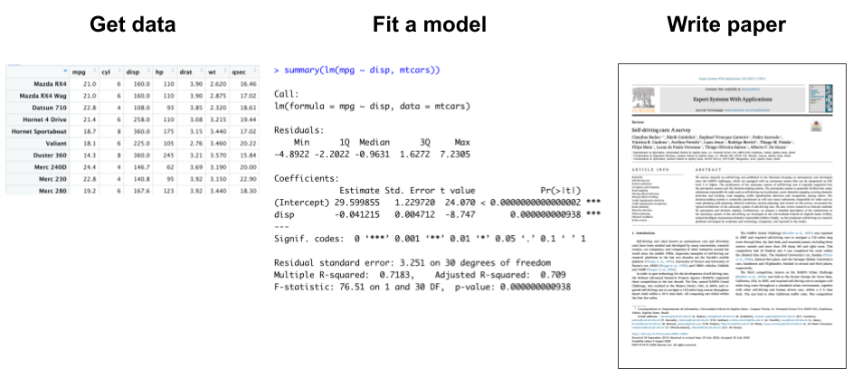
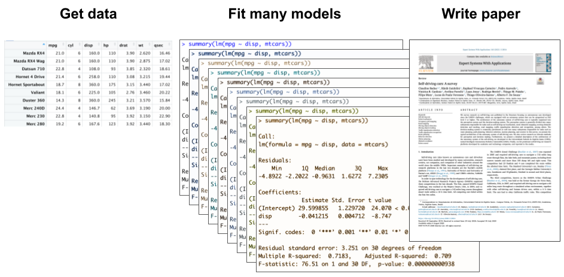
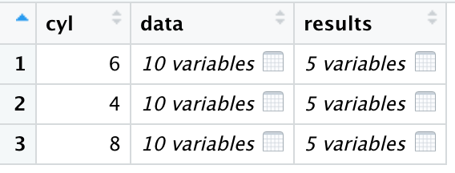
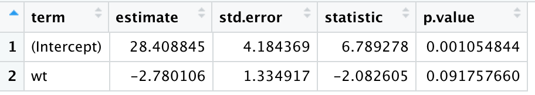

class: titleSlide, hide_logo

```{r setup, include=FALSE}
library(tidyverse)
library(xaringan)
library(xaringanExtra)
library(xaringanthemer)
library(here)
library(sysfonts)
library(showtext)
library(countdown)
library(palmerpenguins)
library(broom)

options(scipen=999)

options(htmltools.dir.version = FALSE)
knitr::opts_chunk$set(
  fig.width=9, fig.height=3.5, fig.retina=3,
  out.width = "100%",
  cache = FALSE,
  echo = TRUE,
  message = FALSE, 
  warning = FALSE,
  hiline = TRUE
)
```

```{r xaringan-panelset, echo=FALSE}
xaringanExtra::use_panelset()
```

```{r xaringan-editable, echo=FALSE}
xaringanExtra::use_editable(expires = 1)
```

```{r xaringan-extra-styles, echo=FALSE}
xaringanExtra::use_extra_styles(
  hover_code_line = TRUE,         #<<
  mute_unhighlighted_code = TRUE  #<<
)
```

```{r xaringanExtra-clipboard, echo=FALSE}
xaringanExtra::use_clipboard()
```

```{r share-again, echo=FALSE}
xaringanExtra::use_share_again()
xaringanExtra::style_share_again(share_buttons="none")
```

```{r xaringan-themer, include=FALSE, warning=FALSE, eval=T}
style_duo_accent(
  primary_color = "#1f9ac9",
  secondary_color = "#444444",
  header_font_google = google_font("Source Sans Pro"),
  text_font_google   = google_font("Libre Franklin", "300", "300i"),
  code_font_google   = google_font("Anonymous Pro"),
  base_font_size = "30px",
  text_font_size = "1rem",
  header_h1_font_size = "2.5rem",
  header_h2_font_size = "2rem",
  header_h3_font_size = "1.25rem",
  padding = "8px 32px 8px 32px",
)

font_add_google("Poppins", "Poppins")
font_add_google("Libre Franklin", "Frank")
showtext_auto()
```

```{r xaringan-logo, echo=FALSE, eval=FALSE}
xaringanExtra::use_logo(
  image_url = "logo.png"
)
```

# Data Wrangling

## Iteration

<br>
<center></center>

---

class: left, hide_logo

### This might be your experience thus far

<br>
<center></center>

---

class: left, hide_logo

### But interation might be in your future

<br>
<center></center>

---

class: left, hide_logo

### It might even be in your present

Do you ever find yourself copying/pasting blocks of code and changing only 1 or 2 things each time?

---

class: left, hide_logo

### It might even be in your present

Take this example, but imagine you want 3 separate plots, not facets.

.pull-left[
```{r, eval=FALSE}
ggplot(penguins, 
       aes(x = bill_length_mm)) +
  geom_histogram() +
  facet_wrap(~species, nrow = 3) + 
  theme_bw() +
  theme(plot.title = 
          element_text(face="bold"))
```
]
.pull-right[
```{r, echo=FALSE, fig.height=7}
ggplot(penguins, 
       aes(x = bill_length_mm)) +
  geom_histogram() +
  facet_wrap(~species, nrow = 3) + 
  theme_bw() +
  theme(plot.title = 
          element_text(face="bold"))
```
]

---

class: left, hide_logo

### Copy/paste with few changes

```{r, eval=FALSE}
p1 <- penguins %>% filter(species == `"Adelie"`) %>%
  ggplot(aes(x = bill_length_mm)) + geom_histogram() + 
  labs(x = "Bill length (mm)", y = NULL,
       title = "Distribution of bill length among `Adelie` penguins") +
  theme_bw() + theme(plot.title = element_text(face="bold"))

p2 <- penguins %>% filter(species == `"Gentoo"`) %>%
  ggplot(aes(x = bill_length_mm)) + geom_histogram() +
  labs(x = "Bill length (mm)", y = NULL,
       title = "Distribution of bill length among `Gentoo` penguins") +
  theme_bw() + theme(plot.title = element_text(face="bold"))

p3 <- penguins %>% filter(species == `"Chinstrap"`) %>%
  ggplot(aes(x = bill_length_mm)) + geom_histogram() + 
  labs(x = "Bill length (mm)", y = NULL,
       title = "Distribution of bill length among `Chinstrap` penguins") +
  theme_bw() + theme(plot.title = element_text(face="bold"))
```

---

class: newTopicSub, hide_logo

# If you copy/paste more than twice, you probably need a function

---
class: left, hide_logo

### Here's a function to create these plots

```{r}
plot_bill_length <- function(penguin_species) {
  
  penguins %>%
    filter(species == penguin_species) %>%
    ggplot(aes(x = bill_length_mm)) +
    geom_histogram() + 
    labs(x = "Bill length (mm)",
         y = NULL,
         title = glue::glue("Distribution of bill length among",
                            penguin_species,
                            "penguins",
                            .sep = " ")) +
    theme_bw() +
      theme(plot.title = element_text(face="bold"))
}
```

---
class: left, hide_logo

### Give into writing functions

Functions make your code easier to understand with fewer opportunities to mess up

.panelset[

.panel[.panel-name[This]

```{r, eval=FALSE}
p1 <- penguins %>% filter(species == "Adelie") %>%
  ggplot(aes(x = bill_length_mm)) + geom_histogram() + 
  labs(x = "Bill length (mm)", y = NULL,
       title = "Distribution of bill length among Adelie penguins") +
  theme_bw() + theme(plot.title = element_text(face="bold"))

p2 <- penguins %>% filter(species == "Gentoo") %>%
  ggplot(aes(x = bill_length_mm)) + geom_histogram() +
  labs(x = "Bill length (mm)", y = NULL,
       title = "Distribution of bill length among Gentoo penguins") +
  theme_bw() + theme(plot.title = element_text(face="bold"))

p3 <- penguins %>% filter(species == "Chinstrap") %>%
  ggplot(aes(x = bill_length_mm)) + geom_histogram() + 
  labs(x = "Bill length (mm)", y = NULL,
       title = "Distribution of bill length among Chinstrap penguins") +
  theme_bw() + theme(plot.title = element_text(face="bold"))
```
]

.panel[.panel-name[Becomes]
```{r, eval=FALSE}
p1 <- plot_bill_length(penguin_species = "Adelie")
p2 <- plot_bill_length(penguin_species = "Gentoo")
p3 <- plot_bill_length(penguin_species = "Chinstrap")
```
]
]


---

class: left, hide_logo

### Let's break this down

```{r, eval=FALSE}
plot_bill_length <- function(penguin_species) {
  
  penguins %>%
    filter(species == penguin_species) %>%
    ggplot(aes(x = bill_length_mm)) +
    geom_histogram() + 
    labs(x = "Bill length (mm)",
         y = NULL,
         title = glue::glue("Distribution of bill length among",
                            penguin_species,
                            "penguins",
                            .sep = " ")) +
    theme_bw() +
      theme(plot.title = element_text(face="bold"))
}
```

---

class: left, hide_logo

### Let's break this down

`function()` is where you define the inputs (or arguments)

```{r, eval=FALSE}
function_name <- `function(x)` {
  # stuff the function does
}
```


--

`{ }` is where you define what the function does

```{r, eval=FALSE}
function_name <- function(x) `{ # stuff the function does }`
}
```

---

class: left, hide_logo

### Example

* Our function is called `plot_bill_length` (short, verb)
* It takes only one argument, `penguin_species` and it has no default

```{r, eval=FALSE}
plot_bill_length <- function(`penguin_species`) {
  # stuff the function does
}

# example with a default value for the argument
  plot_bill_length2 <- function(penguin_species = "Gentoo") {
    # stuff the function does
  }
```

---

class: left, hide_logo

### Inside `{ }` is familiar `ggplot()` code

```{r, eval=FALSE}
plot_bill_length <- function(penguin_species) {
  
  penguins %>%
    filter(species == penguin_species) %>%
    ggplot(aes(x = bill_length_mm)) +
    geom_histogram() + 
    labs(x = "Bill length (mm)",
         y = NULL,
         title = glue::glue("Distribution of bill length among",
                            penguin_species,
                            "penguins",
                            .sep = " ")) +
    theme_bw() +
      theme(plot.title = element_text(face="bold"))
}
```

---

class: left, hide_logo

### The only new pieces are two placeholders

```{r, eval=FALSE}
plot_bill_length <- function(penguin_species) {
  
  penguins %>%
    filter(species == `penguin_species`) %>%
    ggplot(aes(x = bill_length_mm)) +
    geom_histogram() + 
    labs(x = "Bill length (mm)",
         y = NULL,
         title = glue::glue("Distribution of bill length among",
                            `penguin_species`,
                            "penguins",
                            .sep = " ")) +
    theme_bw() +
      theme(plot.title = element_text(face="bold"))
}
```

---

class: left, hide_logo

### The only difference is two placeholders

When you run `plot_bill_length(penguin_species = "Gentoo")`, "Gentoo" gets passed to `penguin_species`.

```{r, eval=FALSE}
plot_bill_length <- function(penguin_species) {
  
  penguins %>%
    filter(species == `penguin_species`) %>%
    ggplot(aes(x = bill_length_mm)) + geom_histogram() + 
    labs(x = "Bill length (mm)", y = NULL,
         title = glue::glue("Distribution of bill length among",
                            `penguin_species`,
                            "penguins",
                            .sep = " ")) +
    theme_bw() + theme(plot.title = element_text(face="bold"))
}
```

---

class: left, hide_logo

### This is what R understands

When you run `plot_bill_length(penguin_species = "Gentoo")`, "Gentoo" gets passed to `penguin_species`.

```{r, eval=FALSE}
  penguins %>%
    filter(species == `"Gentoo"`) %>%
    ggplot(aes(x = bill_length_mm)) + geom_histogram() + 
    labs(x = "Bill length (mm)", y = NULL,
         title = "Distribution of bill length among `Gentoo` penguins") +
    theme_bw() + theme(plot.title = element_text(face="bold"))
}
```


---

class: left, hide_logo

### Stop copying/pasting, write functions instead

.pull-left[
**This works**
<center></center>
]
.pull-right[
**But this is better**
<center></center>
]

---

class: newTopicSub, hide_logo

# But what if we wanted to make not 3, but 33, 333, or 3333 plots?

---

class: left, hide_logo

### For loops + functions

* for `(each item in the sequence)`
* `{do something}`

```{r, eval=FALSE}
for (`s` in c("Adelie", "Gentoo", "Chinstrap")) {
  print(plot_bill_length(penguin_species = `s`))
  # alternatively ggsave(filename = glue::glue(s, ".png"))
}
```

This loop runs the function `plot_bill_length()` three times.
---

class: left, hide_logo

### Here's a basic for loop setup

Compute the mean of every column in mtcars

```{r}
output <- vector("double", ncol(mtcars))
names(output) <- names(mtcars)
for (i in names(mtcars)) {
  output[i] <- mean(mtcars[[i]])
}

output
```
---

class: left, hide_logo

### Here's another example

Start by creating an object to store the output of the loop

```{r}
output <- vector("double", ncol(mtcars))
output
```

---

class: left, hide_logo

### Give each element a name

```{r}
output <- vector("double", ncol(mtcars))
names(output) <- names(mtcars)
output
```

---

class: left, hide_logo

### Define the sequence

```{r, eval=FALSE}
for (`i` in `names(mtcars)`) {

}
```

--

Each time the loop loops, `i` takes a different value: 

```{r}
names(mtcars)
```


---

class: left, hide_logo

### Define what happens in the loop

Calculate the mean, store it in the object `output`

```{r, eval=FALSE}
for (i in names(mtcars)) {
  `output[i] <- mean(mtcars[[i]])`
}
```

--

On the first iteration, `i` takes the value `"mpg"`, the first element of the sequence.

```{r, eval=FALSE}
  output[`"mpg"`] <- mean(mtcars[[`"mpg"`]])
```

---

class: left, hide_logo

### All together now

```{r}
output <- vector("double", ncol(mtcars))
names(output) <- names(mtcars)
for (i in names(mtcars)) {
  output[i] <- mean(mtcars[[i]])
}

output
```

---

class: left, hide_logo

### Evergreen sidenote: There are usually many pathways from A to B

A loop is not strictly required in this case

```{r}
mtcars %>%
  summarise_all(mean)
```

---

class: newTopicSub, hide_logo

# Functional programming can often be a better choice than for loops

---
class: left, hide_logo

### Functionals

A functional is a function that takes a function as an input and returns a vector as output.

---
class: left, hide_logo

## `{purrr}` 

<center></center>

---

class: left, hide_logo

### Here's an example

We pass our `plot_bill_length()` function to the `purrr:map()` function. It iterates over the vector `c("Adelie", "Gentoo", "Chinstrap")` to produce three plots.

```{r, eval=FALSE}
`map`(c("Adelie", "Gentoo", "Chinstrap"), ~ `plot_bill_length(.)`)
```

`~` is pronounced "twiddle"

---

class: left, hide_logo

### Here's what it looks like graphically

<center></center>

* Under the hood `map()` looks like a list but the `map()` function is written in the C language to enhance performance, etc.
* `map()` is similar to the base function `lapply()`

---

class: left, hide_logo

### The map functions

The pattern of looping over a vector, doing something to each element and saving the results is so common that the purrr package provides a family of functions to do it for you. There is one function for each type of output:

* `map()` makes a list
* `map_lgl()` makes a logical vector
* `map_int()` makes an integer vector
* `map_dbl()` makes a double vector
* `map_chr()` makes a character vector

---

class: left, hide_logo

### Anonymous functions

Instead of using map() with an existing function, you can create an inline anonymous function

```{r}
map_dbl(mtcars, ~ length(unique(.x)))
```

---

class: left, hide_logo

### Passing arguments with `...`

It's often convenient to pass along additional arguments to the function that you’re calling. For example, you might want to pass `na.rm = TRUE` along to `mean()`. One way to do that is with an anonymous function:

```{r}
x <- list(1:5, c(1:10, NA))
x
map_dbl(x, mean, na.rm = TRUE)
```

---

class: left, hide_logo

### A typical use case

Fitting a model to subgroups and extracting model coefficients

```{r}
mtcars %>%
  group_by(cyl) %>%
  nest()
```

---

class: left, hide_logo

### Each `<tibble>` is a dataframe

.pull-left[

]

.pull-right[

]

---

class: left, hide_logo

### Next map over each dataframe and fit a model

```{r}
mtcars %>%
  group_by(cyl) %>%
  nest() %>%
  mutate(results = map(.x = data, ~ lm(mpg ~ wt, data = .x) %>% tidy()))
```

---

class: left, hide_logo

### More nesting

.pull-left[

]

.pull-right[

]

---

class: left, hide_logo

### Unnest the results

```{r}
mtcars %>%
  group_by(cyl) %>%
  nest() %>%
  mutate(results = map(.x = data, ~ lm(mpg ~ wt, data = .x) %>% tidy())) %>%
  unnest(cols = results)
```

  
---

class: left, hide_logo

### Filter to just the coefficients we want

```{r}
mtcars %>%
  group_by(cyl) %>%
  nest() %>%
  mutate(results = map(.x = data, ~ lm(mpg ~ wt, data = .x) %>% tidy())) %>%
  unnest(cols = results) %>%
  filter(term=="wt")
```


---
class: left, hide-count

# Credits

Deck by Eric Green ([@ericpgreen](https://twitter.com/ericpgreen)), licensed under Creative Commons Attribution [CC BY-SA 4.0](https://creativecommons.org/licenses/by-sa/4.0/)
* {[`xaringan`](https://github.com/yihui/xaringan)} for slides with help from {[`xaringanExtra`](https://github.com/gadenbuie/xaringanExtra)} 
* [R for Data Science](https://r4ds.had.co.nz/index.html), by Wickham and Grolemund
* [Advanced R](https://adv-r.hadley.nz/index.html), by Wickham
* [Allison Horst's](https://github.com/allisonhorst/stats-illustrations) illustrations
